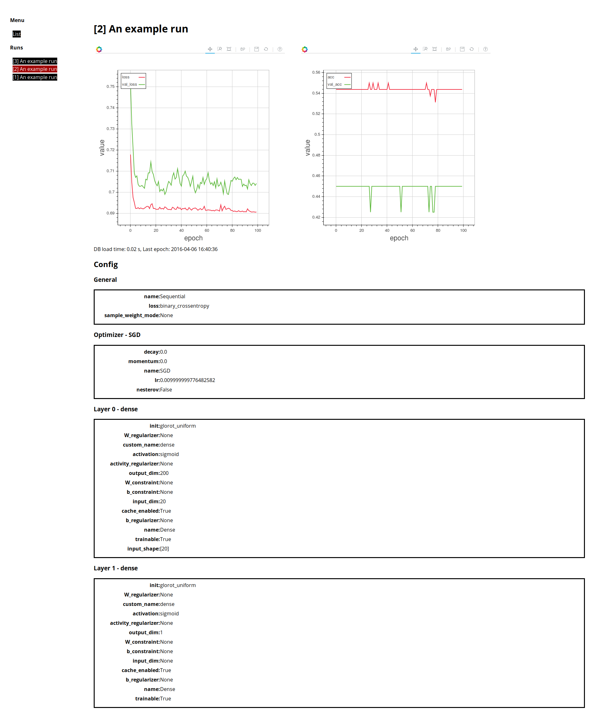

Keras live visualization
========================

This package visualizes ongoing Keras optimizations live in your browser.
Optimization runs are logged in a database. To use this visualization you have to
add `DBLogger` as callback to your optimization. 

Installation
------------

Kerasvis is developed for Python 3 only.
It does not work with Python 2.
There are no plans to add Python 2 support.

Install via pip the [kerasvis](https://pypi.python.org/pypi/kerasvis) package

    pip install kerasvis

or install directly from github:

    pip install git+git://github.com/neuralyzer/kerasvis.git 

Quickstart example
------------------

    from kerasvis import DBLogger
    from keras.models import Sequential
    from keras.layers import Dense

    import scipy as sp
    X = sp.rand(200, 20)
    y = (sp.rand(200, 1) < .5).astype(int)

    model = Sequential()
    model.add(Dense(200, input_dim=20, activation="sigmoid"))
    model.add(Dense(1, activation="sigmoid"))
    model.compile("sgd", "binary_crossentropy")

    logger = DBLogger(comment="An example run")
    history = model.fit(X, y, nb_epoch=100, batch_size=64, verbose=0,
                        validation_split=0.2, callbacks=[logger]

Check the docstring of the DBLogger class for more information.

Start the keras visualization server with

    export FLASK_APP=kerasvis.runserver
    flask run
    
You'll see a web output similar to the one below

Delete runs from the database
-----------------------------

Runs can be deleted with the `DBLogger`. To delete the run with id 3 you do

    db_logger = DBLogger(id=3)
    db_logger.delete()
    
you will then be asked if you really want to delete and have to confirm with "yes".
